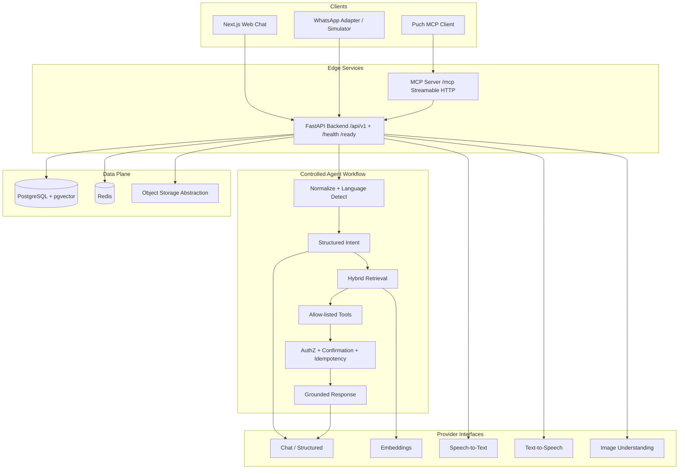

# VaaniDesk — Implementation Plan

**Tagline:** Multilingual AI support across chat, voice and images
**Portfolio target:** Puch AI engineering application
**Phase status:** Phase 3 knowledge/RAG implemented — awaiting review before Phase 4.

**Default Git branch:** `main` (rename from empty-repo `master` before first commit)

---

## 1. Environment findings (2026-08-03)

| Tool | Status | Notes |
|------|--------|-------|
| OS | Windows NT 10.0.26200 | PowerShell available |
| Git | 2.55.0 | Empty repo currently on `master` — switch to **`main`** before first commit |
| Python | **3.14.6** via `py -3` / Local Python | Host only; projects pin **3.12** via `.python-version` and `requires-python = ">=3.12,<3.13"` |
| uv | Installed (`~/.local/bin/uv.exe`) | Preferred Python toolchain; commit `uv.lock` for backend/MCP |
| pip | Available | Fallback if needed |
| Node.js | **Not installed** | Required: **Node.js 24 LTS** (see `.nvmrc`) |
| npm / pnpm | **Not installed** | Install with Node 24; commit the frontend package-manager lockfile |
| Docker / Compose | **Not installed** | Required for Postgres+pgvector, Redis, multi-service demo |
| winget | v1.29.280 | Can install Node and Docker Desktop |

### Phase 0 decisions on toolchain gaps

1. **Backend / MCP Python:** `uv` + **Python 3.12 only** (`requires-python = ">=3.12,<3.13"`). Root `.python-version` = `3.12`. Host 3.14 is not a project target.
2. **Frontend:** Install **Node.js 24 LTS** before Phase 1 scaffold. Root `.nvmrc` = `24`.
3. **Infrastructure:** Install Docker Desktop before Phase 1 Compose bring-up.
4. **Repo root:** Workspace is the VaaniDesk monorepo; product name in README is **VaaniDesk**.
5. **Lockfiles / meta:** Planned committed artifacts include `uv.lock`, frontend lockfile (`package-lock.json` or `pnpm-lock.yaml`), `.editorconfig`, and `LICENSE`.

---

## 2. Problem statement

Build a production-shaped multilingual, multimodal AI customer-support platform for a fictional e-commerce brand. The system must handle Hinglish/code-switching, RAG over policies, allow-listed tool calling, MCP exposure for Puch (including mandatory `validate` / `resume` tools), voice/image channels, strict user isolation, evals, and observability — demonstrable in **mock mode** without paid API keys.

---

## 3. Architecture summary

### High-level



### API versioning

| Path | Versioned? |
|------|------------|
| `/api/v1/*` | Yes — all product/business HTTP APIs |
| `/health` | No |
| `/ready` | No |
| `/mcp` | No — MCP Streamable HTTP entrypoint on the MCP service |

### Controlled agent workflow (not an autonomous loop)

```text
receive → normalize → identify user/conversation → detect language
→ classify intent → decide retrieval → retrieve evidence
→ select allow-listed tool → validate args → AuthZ + risk
→ confirmation if needed → idempotency check → execute tool
→ grounded response → confidence / escalate → respond → traces + metrics
```

### Finalized ADRs

See [`docs/ADR.md`](./docs/ADR.md) for the authoritative list (ADR-001 … ADR-019). Highlights:

- MCP Python **SDK v2** + **Streamable HTTP**; Puch compatibility layer for bearer auth + `validate` / `resume`
- Redis: optional caches degrade; security paths **fail closed**
- Mock embeddings = deterministic **lexical n-gram hashing** (not production semantics)
- Phase 1 models limited to User, Conversation, Message, Product, Order, OrderItem
- Sensitive tools: confirmation tokens **and** idempotency records

### Deviation from suggested tree

- `backend/app/workflows/` — explicit step orchestrator
- `backend/app/channels/whatsapp/` — simulator vs cloud adapter split
- `infra/` — optional deploy manifests
- `docs/ADR.md` — finalized architectural decisions
- Root pin files: `.nvmrc`, `.python-version`, `.editorconfig`, `LICENSE`
- Lockfiles committed when generated: `uv.lock`, frontend package-manager lockfile
- Root `SECURITY.md` → `docs/SECURITY.md`

---

## 4. Proposed repository file tree

```text
vaanidesk/   (repo root = this workspace; default branch main)
├── backend/
│   ├── app/
│   │   ├── api/                 # versioned routers under /api/v1
│   │   ├── agents/
│   │   ├── workflows/
│   │   ├── channels/
│   │   ├── core/                # includes unversioned /health /ready wiring
│   │   ├── database/
│   │   ├── models/
│   │   ├── providers/
│   │   ├── rag/
│   │   ├── schemas/
│   │   ├── security/            # AuthZ, confirmation, idempotency, rate limit
│   │   ├── services/
│   │   ├── tools/
│   │   ├── observability/
│   │   └── main.py
│   ├── tests/
│   ├── alembic/
│   ├── scripts/
│   ├── pyproject.toml           # requires-python = ">=3.12,<3.13"
│   ├── uv.lock                  # committed when generated
│   └── Dockerfile
├── frontend/
│   ├── src/app/
│   ├── src/components/
│   ├── src/lib/
│   ├── package.json
│   ├── package-lock.json | pnpm-lock.yaml   # commit whichever PM is chosen
│   └── Dockerfile
├── mcp_server/
│   ├── app/                     # MCP SDK v2 Streamable HTTP + Puch layer
│   ├── tests/
│   ├── pyproject.toml           # requires-python = ">=3.12,<3.13"
│   ├── uv.lock                  # committed when generated
│   └── Dockerfile
├── evals/
│   ├── datasets/
│   ├── evaluators/
│   ├── reports/
│   └── run_evals.py
├── sample_data/
│   ├── policies/
│   ├── products/
│   ├── orders/
│   └── resume/                  # resume Markdown path target (not hardcoded body)
├── docs/
│   ├── ADR.md
│   ├── ARCHITECTURE.md
│   ├── API.md
│   ├── DEPLOYMENT.md
│   ├── EVALUATION.md
│   ├── SECURITY.md
│   └── DEMO_SCRIPT.md
├── scripts/
├── infra/
├── docker-compose.yml
├── .env.example
├── .editorconfig
├── .gitignore
├── .nvmrc                       # 24
├── .python-version              # 3.12
├── .github/workflows/ci.yml     # Phase 7
├── LICENSE
├── README.md
├── PLAN.md
├── TASKS.md
└── SECURITY.md
```

---

## 5. Major dependencies (planned)

### Backend (`backend/pyproject.toml`)

- `requires-python = ">=3.12,<3.13"`
- fastapi, uvicorn[standard], pydantic, pydantic-settings
- sqlalchemy[asyncio]≥2, asyncpg, alembic, pgvector
- redis, httpx
- python-multipart
- structured JSON logging
- pytest, pytest-asyncio, httpx, ruff, mypy
- Optional extras: openai, anthropic
- Lockfile: **`uv.lock`** (committed)

### Frontend

- Node.js **24** (`.nvmrc`)
- next (App Router), react, typescript, tailwindcss
- Commit **package-manager lockfile**

### MCP (`mcp_server/pyproject.toml`)

- `requires-python = ">=3.12,<3.13"`
- **MCP Python SDK v2** with **Streamable HTTP** transport
- Puch compatibility layer (bearer / application-key behavior)
- httpx to backend `/api/v1` (prefer HTTP isolation)
- Lockfile: **`uv.lock`** (committed)

### Infra

- postgres:16 with pgvector image
- redis:7
- docker compose healthchecks

Versions pinned in Phase 1 — not mass-installed in Phase 0.

---

## 6. Credential requirements

| Secret / config | Required for | Mock / local demo |
|-----------------|--------------|-------------------|
| `DATABASE_URL` | Persistence | Compose / local PG |
| `REDIS_URL` | Cache + **security** state | Compose; see Redis failure policy below |
| `SECRET_KEY` | Demo session signing | Generated locally |
| `LLM_PROVIDER` | AI path | `mock` default |
| `OPENAI_API_KEY` / `ANTHROPIC_API_KEY` | Real LLM | Optional |
| `EMBEDDING_PROVIDER` | RAG vectors | `mock` = lexical baseline (not semantic) |
| `STT_PROVIDER` / `TTS_PROVIDER` / `VISION_PROVIDER` | Multimodal | `mock` |
| WhatsApp secrets | Live WhatsApp | Simulator when unset |
| `MCP_BEARER_TOKEN` | Generic MCP bearer (if used) | Generated locally |
| `PUCH_APPLICATION_KEY` | Puch MCP auth (compatibility layer) | Required for Puch; **never hardcode** |
| `PUCH_PHONE_NUMBER` | `validate` tool response | Required for Puch validate; **never hardcode** |
| `RESUME_MARKDOWN_PATH` | `resume` tool file path | Path only; file contents not in source |
| Object storage creds | Production uploads | Local FS in demo |

**Never commit real values.** Never hardcode application key, phone number, or resume contents.

### Redis failure behavior

| Use of Redis | If Redis unavailable |
|--------------|----------------------|
| Optional caches (response/read-through, best-effort buffers) | **Degrade gracefully** |
| Confirmation tokens | **Fail closed** |
| Webhook / event replay protection | **Fail closed** |
| Sensitive-action authorization state | **Fail closed** |
| Security rate limits | **Fail closed** |

### Idempotency-record design (sensitive / destructive tools)

For tools such as `cancel_order`, `update_delivery_address`, `create_refund_request` (and equivalents):

1. Client or workflow supplies an `idempotency_key` (or one is derived from confirmation token + tool + canonical args).
2. Before mutation, look up idempotency record `(user_id, tool_name, idempotency_key)`.
3. If a **completed** record exists → return the stored structured result (no second mutation).
4. If **in progress** → reject or wait per policy (no parallel double-apply).
5. On first success → persist record with result payload, status, timestamps.
6. Records are durable (Postgres), not Redis-only, so Redis outages do not erase commit history; Redis may still gate confirmation tokens (fail closed).

---

## 7. Mock-mode behavior

| Capability | Behavior |
|------------|----------|
| Chat / intent / language | Rule + heuristic classifier; deterministic structured outputs |
| Embeddings | **Deterministic lexical hashing** over normalized word and/or character n-grams → fixed-dimension vectors for reproducible offline tests. **Not** production semantic embeddings. |
| STT / TTS / Vision | Fixtures / heuristics; clearly labeled |
| WhatsApp | Labeled simulator when credentials absent |
| Evals | Run against mock stack; scores are real for that stack |

---

## 8. Database models by phase

### Phase 1 (foundation only)

- `User`
- `Conversation`
- `Message`
- `Product`
- `Order`
- `OrderItem`

UUIDs, timestamps, indexes; order access scoped by `user_id`.

### Later phases (not in Phase 1 migrations)

| Model | Target phase |
|-------|----------------|
| `SupportTicket` | Phase 2 |
| `ToolExecution`, `AgentTrace` | Phase 2 |
| `KnowledgeDocument`, `KnowledgeChunk` | Phase 3 |
| `Feedback` | Phase 6 (or late Phase 2 if chat feedback UI needs it earlier — default Phase 6) |
| `EvaluationRun`, `EvaluationResult` | Phase 6 |
| `CustomerProfile` | Phase 2 (profile enrichment; not required for Phase 1 chat seed) |
| Idempotency records table | Phase 2 (with sensitive tools) |

---

## 9. Phase acceptance criteria

### Phase 0 — conditional approval corrections

- [x] Review corrections applied to planning docs
- [ ] Re-review gate before Phase 1 application development

### Phase 1 — Working foundation

- Default branch `main`; Node 24 + Python 3.12 pins present
- Compose starts API + PG + Redis + frontend
- Migrations for **Phase 1 models only** + seed
- Web chat round-trip via **`/api/v1`** with mock provider
- Unversioned `/health` and `/ready` OK
- pytest + ruff + mypy (or documented blockers) pass
- `requires-python` and lockfile plan honored as soon as projects exist

### Phase 2 — Agent and tools

- Hinglish order status → correct tool + args
- Cross-user order access denied
- Sensitive actions require confirmation + idempotency behavior
- Traces / tool executions persisted; Redis security paths fail closed (tested)
- Tests pass

### Phase 3 — RAG

- Citations; no-answer on low confidence
- Lexical mock vectors documented as non-semantic; real embeds optional
- Doc-injection cannot force unrelated tools

### Phase 4 — Voice and images

- Valid media processed; invalid rejected; mock labeled; no overclaim on legal/refund decisions

### Phase 5 — MCP (Puch-compatible)

- MCP Python SDK **v2** + **Streamable HTTP** at `/mcp`
- Puch compatibility layer: bearer / `PUCH_APPLICATION_KEY` behavior
- Support tools (allow-listed) + mandatory Puch tools:
  - `validate` → returns configured `PUCH_PHONE_NUMBER`
  - `resume` → returns clean Markdown loaded from `RESUME_MARKDOWN_PATH`
- Per-user scoping; no secrets in responses
- **Acceptance tests must include:**
  - successful `validate`
  - successful Markdown `resume` retrieval
  - invalid application key
  - missing phone configuration
  - missing resume file
  - (also) invalid token / malformed JSON-RPC / cross-user / timeout as previously planned

### Phase 6 — Evals and observability

- ≥150 cases; real reports; dashboard from real traces

### Phase 7 — Production hardening

- Threat model, CI, deploy docs, demo script; clean-install path

---

## 10. Risks

| Risk | Impact | Mitigation |
|------|--------|------------|
| Host Python 3.14 | Wrong interpreter used | `.python-version` + uv 3.12 + Docker 3.12 |
| Node/Docker missing | Phase 1 blocked | Install Node **24** + Docker before Phase 1 |
| Lexical mock vectors | Weak semantic RAG in mock mode | Document clearly; optional real embeddings |
| Redis down + fail-closed | Sensitive actions unavailable | Correct and tested; prefer availability of safety over silent bypass |
| Puch auth/tool contract drift | Application rejection | Compatibility layer + Phase 5 acceptance tests |
| Scope creep | Incomplete portfolio | Hard phase gates |

---

## 11. Exact next-phase plan (Phase 1) — after re-approval

**Objective:** Bootable foundation with mock chat; **no** full agent/RAG/MCP app yet.

**Prerequisites:**

1. Rename default branch to **`main`**
2. Install **Node.js 24 LTS** (honor `.nvmrc`)
3. Install **Docker Desktop**
4. `uv python install 3.12` and create backend venv with `requires-python = ">=3.12,<3.13"`

**Will create/change:**

- Compose: api, frontend, postgres+pgvector, redis
- Backend FastAPI: settings, DB, Alembic for Phase 1 models only
- Unversioned `/health`, `/ready`; versioned chat under `/api/v1`
- Frontend Next.js on Node 24 with `/` and `/chat`
- Mock LLM provider + seed for users/products/orders
- Begin `uv.lock` + frontend lockfile
- Tests/lint/types; update TASKS

**Explicitly deferred:** MCP server implementation, Puch tools, RAG tables, AgentTrace, SupportTicket, etc.

**Stop** after Phase 1 verification for review.

---

## 12. Out of scope for Phase 0

Backend, frontend, and MCP **application code** — deferred until Phase 1+ after re-review.
