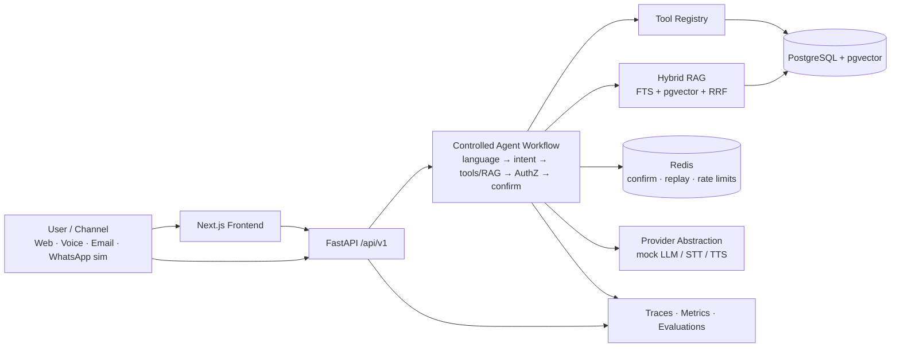
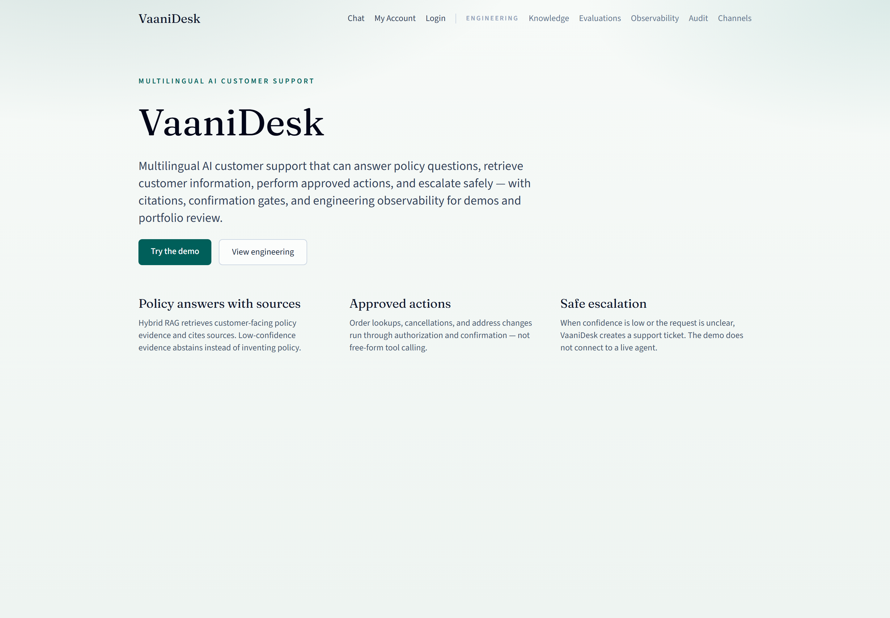
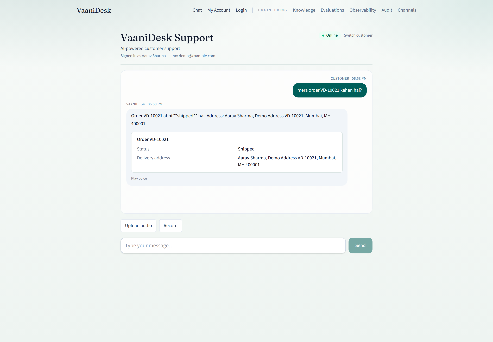
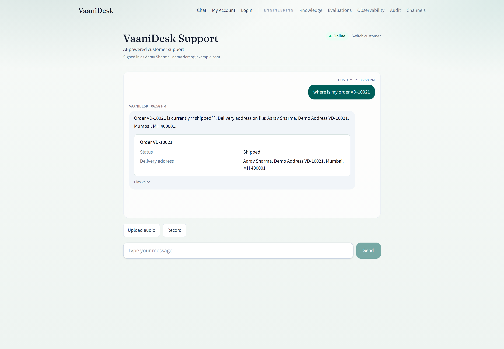
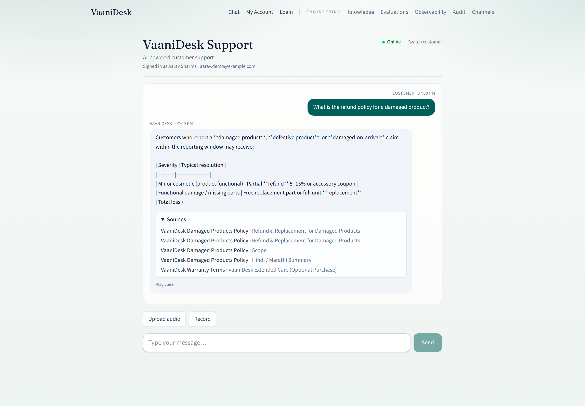
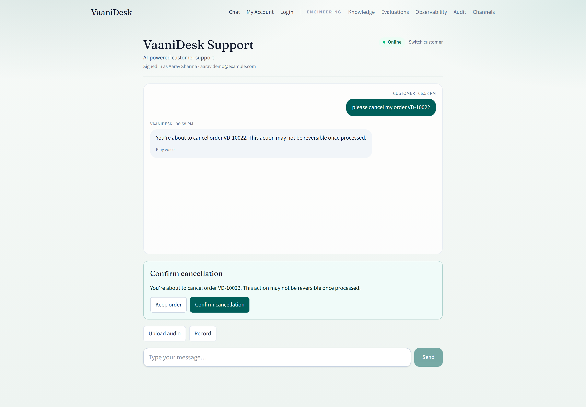
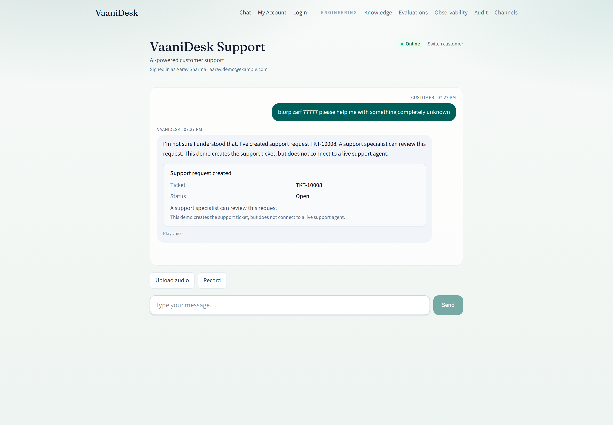
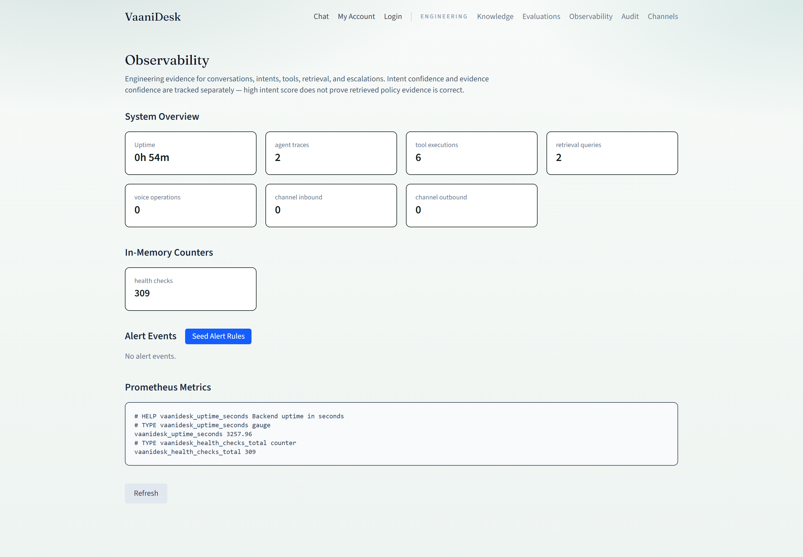
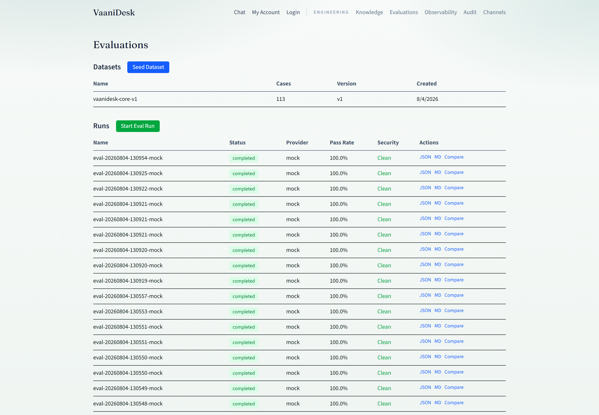

# VaaniDesk v1.0.1

**Multilingual AI support across chat, voice and images**

[](https://github.com/miransec/vaanidesk/actions/workflows/ci.yml)
[](./LICENSE)

**Repository:** [github.com/miransec/vaanidesk](https://github.com/miransec/vaanidesk)

VaaniDesk is a **production-oriented multilingual AI customer-support platform** for a fictional e-commerce brand. It is a portfolio engineering project that demonstrates how to ship controlled agents, hybrid retrieval, secure business actions, evaluations, and observability — with **deterministic mock providers** so the full stack runs without paid APIs.

It is **not** a live SaaS product and does **not** claim production LLM/STT/TTS/WhatsApp/SMTP connectivity unless you configure optional credentials yourself.

---

## Live demo

**Live demo:** [https://vaanidesk.muhammadmiran.com](https://vaanidesk.muhammadmiran.com)

**Chat:** [https://vaanidesk.muhammadmiran.com/chat](https://vaanidesk.muhammadmiran.com/chat)

Portfolio case study: [muhammadmiran.com/projects/vaanidesk](https://muhammadmiran.com/projects/vaanidesk)

Public demo notes: deterministic mock LLM/STT/TTS, curated personas only, simulated support tickets (no live human agent).

---

## Local development

These URLs are for a **local** Docker or development stack only. They are **not** public demo URLs.

| Surface | Local URL |
|---------|-----------|
| Frontend | http://localhost:3000 |
| Chat | http://localhost:3000/chat |
| Backend | http://localhost:8000 |
| Development API docs | http://localhost:8000/docs |
| Health | http://localhost:8000/health |

---

## Why this project exists

Customer-support AI fails in practice when language switching, tool misuse, weak authorization, or uncited answers slip through. VaaniDesk is built to show the hard parts:

- Hinglish / code-switching language detection
- Allow-listed tool calling with ownership checks
- Sensitive-action confirmation tokens and idempotency
- Hybrid RAG with source citations and no-answer thresholds
- Prompt-injection boundaries (including retrieved-document isolation)
- Multilingual evaluation and security-critical regression gates
- Auth, Docker, CI, and browser E2E around the same workflow

---

## Engineering highlights

| Area | What is implemented |
|------|---------------------|
| **Languages** | English, Hindi, Marathi, Hinglish detection + response routing |
| **Controlled agents** | Intent → allow-listed tools → AuthZ → optional confirmation → traces |
| **Hybrid RAG** | FTS + pgvector, Reciprocal Rank Fusion, citations, evidence confidence, no-answer path |
| **Security** | JWT/refresh rotation, CSRF/origin checks, role enforcement, log redaction |
| **Voice** | Upload → mock STT → transcript review → orchestrator; mock TTS playback |
| **Channels** | Email inbox simulator, WhatsApp simulator, HMAC webhooks, identity linking |
| **Evaluations** | 113 deterministic cases; security-critical failures fail the run |
| **Observability** | Prometheus `/metrics`, OTel hooks, structured logs, admin audit UI |
| **Delivery** | Docker Compose, Alembic migrations, GitHub Actions CI, Playwright E2E |

**Image handling (honest scope):** channel attachment validation and damage-policy RAG exist. A dedicated vision / image-understanding model pipeline is **not** shipped in v1.0.1 (config stub only). The product tagline retains the multimodal direction.

**MCP:** environment placeholders and ADRs describe a future Puch-compatible MCP surface. There is **no** `mcp_server` package in this repository yet.

---

## Architecture (high level)



**Security boundary:** models never call the database directly. Tools are allow-listed; ownership is enforced in the service layer; sensitive writes require confirmation tokens; Redis security paths fail closed.

Deeper diagrams and layer notes: [`docs/ARCHITECTURE.md`](./docs/ARCHITECTURE.md) · threat model: [`docs/SECURITY.md`](./docs/SECURITY.md)

---

## Verified v1.0.1 quality gates

| Gate | Result |
|------|--------|
| Backend pytest | **206** passed |
| Deterministic evaluations (mock provider) | **113 / 113** passed |
| Security-critical evaluation cases | **40** cases, **0** failures |
| Playwright E2E (Chromium) | **14** passed |
| mypy (`python -m mypy app`) | clean (strict) |
| Ruff lint + format | pass |
| Frontend lint + production build | pass |
| Docker development stack | healthy (`/health`, `/ready`) |
| Secret scan (gitleaks) | pass |

Precise wording: **113/113 deterministic evaluation cases passed using the mock provider** — not “100% AI accuracy.”

Release notes: [`CHANGELOG.md`](./CHANGELOG.md) · GitHub metadata: [`docs/GITHUB_RELEASE.md`](./docs/GITHUB_RELEASE.md)

---

## Quick start (local)

```powershell
git clone https://github.com/miransec/vaanidesk.git
cd vaanidesk
copy .env.example .env
docker compose up --build -d
docker compose exec backend uv run alembic upgrade head
docker compose exec backend uv run python -m scripts.seed
docker compose exec backend uv run python -m scripts.seed_knowledge
```

Then open the **Local development** URLs above.

Try the demo as **Aarav Sharma** (internal key `demo-anya`, kept for compatibility):

1. `where is my order VD-10021` — active/shipping order status
2. `what is your return policy for unused items?` — hybrid RAG + **Sources**
3. `What is the refund policy for a damaged product?` — Damaged Products policy citations
4. `please cancel my order VD-10022` — confirmation UI (Keep order / Confirm cancellation)
5. Voice upload on `/chat` — transcript confirm → workflow
6. `/admin/evaluations` — run mock suite; `/admin/observability` — engineering evidence

2–4 minute narrative: [`docs/DEMO_SCRIPT.md`](./docs/DEMO_SCRIPT.md) · one-command notes: [`docs/DEMO.md`](./docs/DEMO.md)

---

## Screenshots

Portfolio UI captures (real application, v1.0.1):

| | |
|-|-|
|  |  |
|  |  |
|  |  |
|  |  |

Capture notes: [`docs/assets/screenshots/README.md`](./docs/assets/screenshots/README.md)

---

## Stack

| Layer | Choice |
|-------|--------|
| Backend | Python 3.12, FastAPI, SQLAlchemy, Alembic, Redis |
| Frontend | Next.js 15, React 19, TypeScript, Tailwind |
| Data | PostgreSQL 16 + pgvector |
| Quality | pytest, Ruff, mypy, Playwright, GitHub Actions |
| Default AI | Deterministic mock LLM / STT / TTS / embeddings |

---

## Development tooling

| Tool | Version |
|------|---------|
| Git | branch `main` |
| Python | **3.12** via `uv` |
| Node.js | **24** LTS |
| Docker Desktop | Compose stack |

### Backend

```powershell
cd backend
uv sync --extra dev
uv run alembic upgrade head
uv run python -m scripts.seed
uv run python -m scripts.seed_knowledge
uv run uvicorn app.main:app --reload --port 8000
```

### Frontend

```powershell
cd frontend
npm ci
npm run dev
```

### Quality commands

```powershell
# Backend
cd backend
uv run pytest -rs
uv run ruff check .
uv run ruff format --check .
uv run python -m mypy app
uv run python -m scripts.run_evaluations --provider mock --seed 42

# Frontend
cd frontend
npm run lint
npm run build
npm run test:e2e
```

Demo auth header (not production): `X-Demo-User-Key: demo-anya`.

---

## Mock vs optional integrations

| Mode | Included |
|------|----------|
| **Mock (default)** | Deterministic LLM workflow, mock STT/TTS, lexical embeddings, email inbox simulator, WhatsApp simulator |
| **Optional / credential-dependent** | OpenAI-compatible LLM, cloud speech, WhatsApp Cloud API, SMTP, public HTTPS deployment |

Never hardcode `PUCH_APPLICATION_KEY`, resume Markdown, JWT secrets, or production DB passwords. Copy `.env.example` → `.env` locally only.

---

## Documentation

| Doc | Purpose |
|-----|---------|
| [`docs/ARCHITECTURE.md`](./docs/ARCHITECTURE.md) | Layers, auth flow, Mermaid overview |
| [`docs/API.md`](./docs/API.md) | HTTP surfaces |
| [`docs/SECURITY.md`](./docs/SECURITY.md) | Controls and threat notes |
| [`docs/EVALUATIONS.md`](./docs/EVALUATIONS.md) | Eval dataset and runner |
| [`docs/DEPLOYMENT.md`](./docs/DEPLOYMENT.md) | Production Compose / Caddy |
| [`docs/DEMO_SCRIPT.md`](./docs/DEMO_SCRIPT.md) | Portfolio walkthrough |
| [`docs/GITHUB_RELEASE.md`](./docs/GITHUB_RELEASE.md) | Repo description & topics |
| [`SECURITY.md`](./SECURITY.md) | Vulnerability reporting |
| [`CONTRIBUTING.md`](./CONTRIBUTING.md) | Dev setup & standards |
| [`PLAN.md`](./PLAN.md) · [`TASKS.md`](./TASKS.md) | Historical build plan (some future items remain aspirational) |

---

## License

MIT — see [`LICENSE`](./LICENSE).
