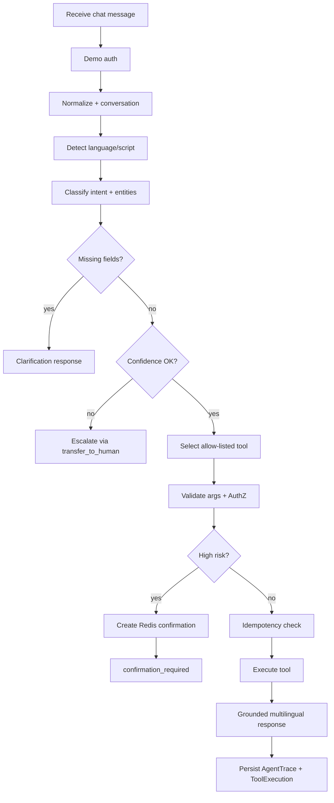
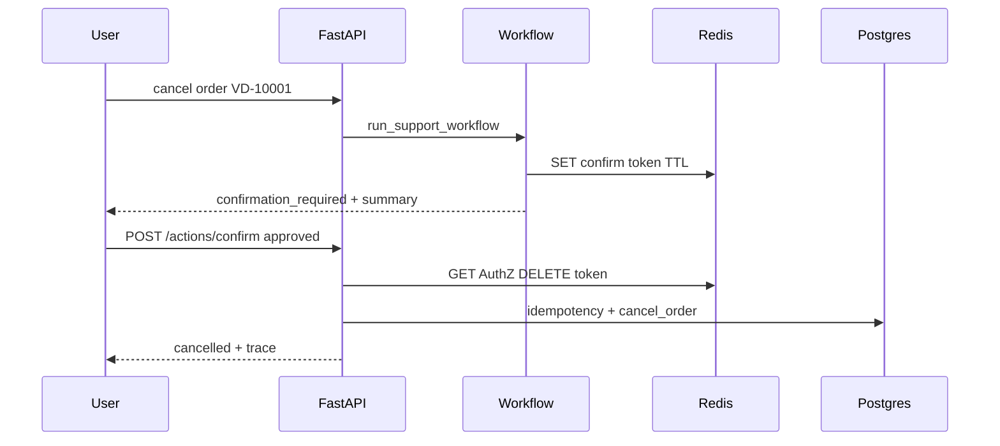
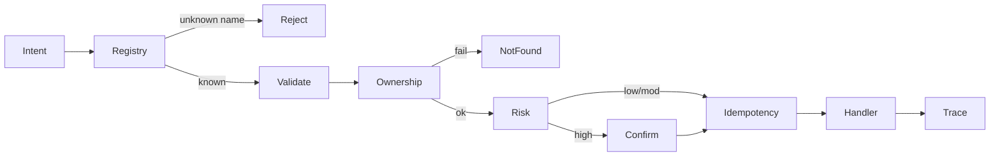
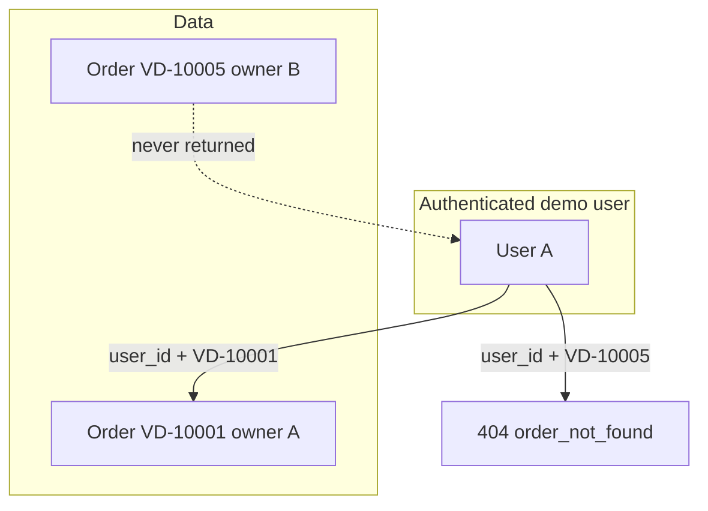

# VaaniDesk Architecture

**Phase:** 2 (controlled agent workflow + business tools)
**Companion docs:** [`../PLAN.md`](../PLAN.md), [`../TASKS.md`](../TASKS.md), [`ADR.md`](./ADR.md), [`API.md`](./API.md)

---

## Phase 2 agent workflow

## Confirmation flow

## Tool execution flow

## Cross-user authorization boundary

## Design principles

1. Controlled workflow — explicit steps, not an unbounded autonomous agent loop
2. Allow-listed tools only
3. User-data isolation — ownership checks in tool/service layer
4. Fail closed on Redis security paths
5. Idempotent sensitive mutations
6. Honest demos — no fake live human agents

## Language detector limitations

Heuristic script + cue matching for `en` / `hi` / `hinglish` / `mr` / `unknown`. Not a production language model. Replaceable via `LanguageDetector` protocol.

## Intent taxonomy

`greeting`, `order_status`, `order_details`, `update_delivery_address`, `cancellation_eligibility`, `cancel_order`, `create_support_ticket`, `support_ticket_status`, `human_escalation`, `unknown`

## Tool registry (Phase 2)

| Tool | Risk | Confirmation | Idempotency |
|------|------|--------------|-------------|
| get_order_status | low | no | no |
| get_order_details | moderate | no | no |
| update_delivery_address | high | yes | yes |
| check_cancellation_eligibility | low | no | no |
| cancel_order | high | yes | yes |
| create_support_ticket | moderate | no | yes |
| get_support_ticket_status | low | no | no |
| transfer_to_human | moderate | no | yes |

Later phases add RAG, multimodal, MCP, and evals — see PLAN.md.
