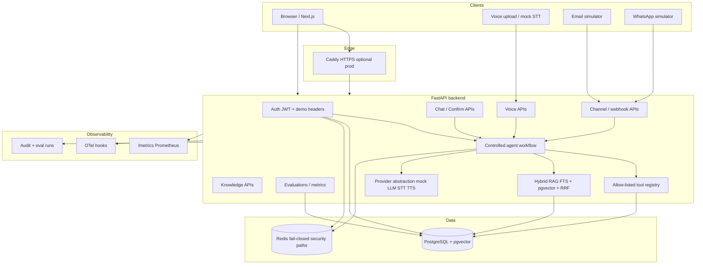

# VaaniDesk — Architecture

## System overview

VaaniDesk is a multilingual AI customer-support platform with text chat, voice transport into the same controlled orchestrator, and omnichannel simulators (email, WhatsApp). Default AI providers are deterministic mocks.



### Security boundaries

| Boundary | Rule |
|----------|------|
| Model → data | LLM/STT/TTS never open SQL or Redis connections |
| Tools | Allow-listed only; ownership checked in services |
| Sensitive writes | Confirmation token + TTL + replay rejection + idempotency |
| Retrieved docs | Untrusted data; cannot authorize tools by itself |
| Redis security features | Fail closed if Redis unavailable |
| Secrets | `.env` / secret manager only — never in source |

## ASCII deploy sketch (production Compose)

```
┌─────────────┐     ┌──────────────┐     ┌──────────────┐
│   Browser   │────▶│   Caddy      │────▶│   Next.js    │
│             │     │   (HTTPS)    │     │   Frontend   │
└─────────────┘     └──────┬───────┘     └──────────────┘
                           │
                    ┌──────▼───────┐
                    │   FastAPI    │
                    │   Backend    │
                    └──┬───────┬──┘
                       │       │
              ┌────────▼──┐  ┌─▼────────┐
              │ PostgreSQL │  │  Redis   │
              │ + pgvector │  │          │
              └───────────┘  └──────────┘
```

## Backend layer structure

```
app/
├── api/v1/          # HTTP route handlers (thin controllers)
│   ├── auth.py
│   ├── chat.py
│   ├── knowledge.py
│   ├── voice.py
│   ├── channels.py
│   └── evaluations.py
├── services/        # Business logic + AuthZ
├── models/          # SQLAlchemy ORM
├── agents/          # Language + intent + response templates
├── workflows/       # Orchestration + confirmation
├── providers/       # LLM/STT/TTS abstraction (mock default)
├── security/        # Confirmation tokens, redaction helpers
├── observability/   # Metrics, tracing, logging filters
├── core/            # Config, errors, middleware, Redis
└── database/        # Session factory
```

## Authentication flow

```
Register → hash(pepper + password) → store Argon2id hash → return profile

Login → verify hash → create JWT access (15 min) + refresh session (7 day)
      → set refresh in HttpOnly cookie → return access token

Refresh → validate old refresh → revoke old → create new pair → rotate cookie

Logout → revoke refresh session → clear cookie
```

Demo mode may still accept `X-Demo-User-Key` when `DEMO_MODE=true` (local/demo only).

## Key design decisions

1. **Mock-first providers** — reproducible tests and demos without paid APIs
2. **Service-layer auth** — role and ownership checks beyond the UI
3. **Fail-closed Redis** — confirmation / replay / sensitive rate paths
4. **Structured logging** — JSON with secret redaction filters
5. **Explicit workflow** — no unconstrained tool loops

## Frontend

Next.js 15 App Router:

- Client components for chat, voice, auth
- Access token in memory (not `localStorage`)
- Refresh via HttpOnly cookie
- Tailwind CSS

## Database

PostgreSQL 16 + pgvector. Alembic revisions `0001`–`0007`.

## Observability

- Prometheus metrics at `/metrics`
- OpenTelemetry tracing boundaries (console/no-op by default)
- Structured JSON logs with secret redaction
- Alert rules stored/logged in dev — no PagerDuty/Slack claimed

## Out of scope in v1.0.0 application code

- Dedicated vision / image-understanding pipeline (config stub only)
- MCP Streamable HTTP server package (documented as future / env placeholders only)
