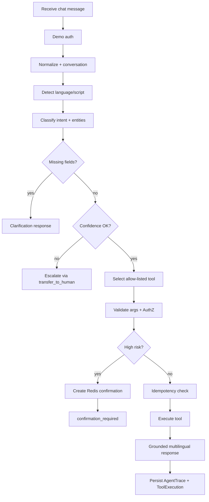
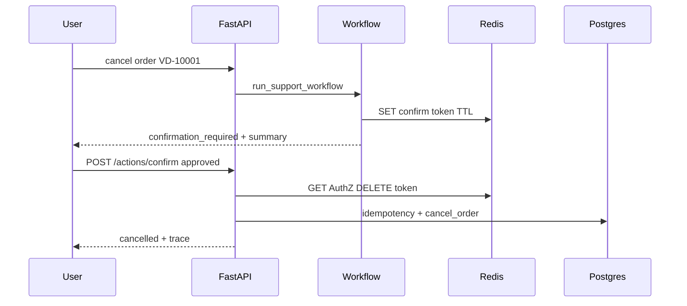
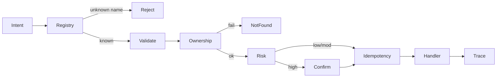
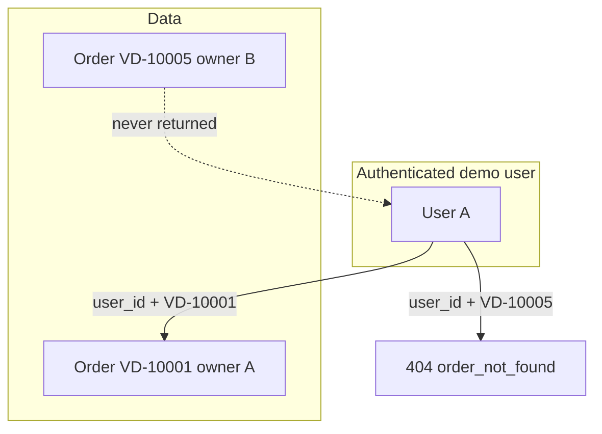
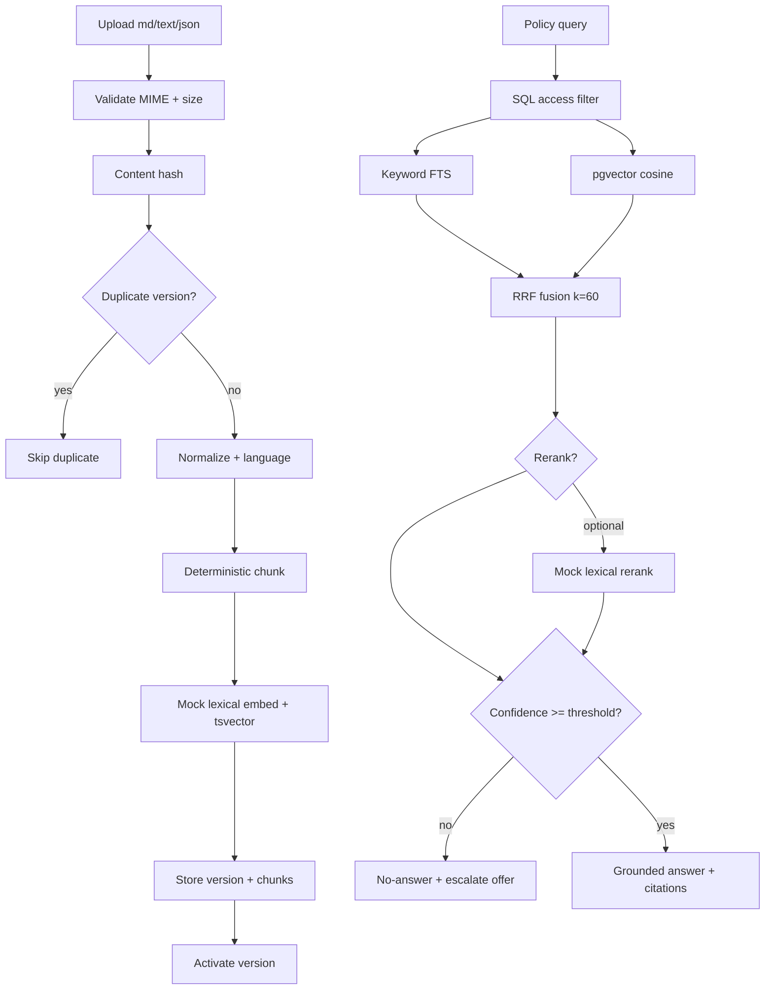
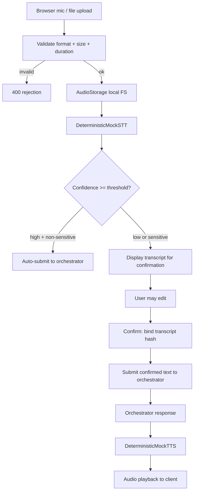

# VaaniDesk Architecture

**Phase:** 4 (voice transport + knowledge/RAG + tools)
**Companion docs:** [`../PLAN.md`](../PLAN.md), [`../TASKS.md`](../TASKS.md), [`ADR.md`](./ADR.md), [`API.md`](./API.md)

---

## Phase 2 agent workflow



## Confirmation flow



## Tool execution flow



## Cross-user authorization boundary



## Design principles

1. Controlled workflow — explicit steps, not an unbounded autonomous agent loop
2. Allow-listed tools only
3. User-data isolation — ownership checks in tool/service layer
4. Fail closed on Redis security paths
5. Idempotent sensitive mutations
6. Honest demos — no fake live human agents

## Language detector limitations

Heuristic script + cue matching for `en` / `hi` / `hinglish` / `mr` / `unknown`. Not a production language model. Replaceable via `LanguageDetector` protocol.

## Intent taxonomy

`greeting`, `order_status`, `order_details`, `update_delivery_address`, `cancellation_eligibility`, `cancel_order`, `create_support_ticket`, `support_ticket_status`, `human_escalation`, `policy_question`, `unknown`

## Tool registry (Phase 2)

| Tool | Risk | Confirmation | Idempotency |
|------|------|--------------|-------------|
| get_order_status | low | no | no |
| get_order_details | moderate | no | no |
| update_delivery_address | high | yes | yes |
| check_cancellation_eligibility | low | no | no |
| cancel_order | high | yes | yes |
| create_support_ticket | moderate | no | yes |
| get_support_ticket_status | low | no | no |
| transfer_to_human | moderate | no | yes |

## Phase 3 knowledge / retrieval



### Ingestion lifecycle

receive → validate type/size → hash → duplicate detect → normalize → language → chunk → embed → tsvector → store → activate → record job

### Chunking

Heading / blank-line aware windows (~500 chars, ~60 overlap). Same input → same chunks.

### Embeddings

`LexicalHashEmbeddingProvider`: word uni/bigrams + char 3-grams → stable feature hash → L2-normalized 384-d vectors.

**Label:** Deterministic lexical embedding baseline for local development and testing — not production semantic embeddings.

### Retrieval strategies

1. `keyword` — PostgreSQL `plainto_tsquery('simple')` + `ts_rank`
2. `vector` — pgvector cosine distance on mock embeddings
3. `hybrid` — independent candidate lists fused with RRF: `score(d) = Σ 1/(k + rank_i(d))`, `k=60`
4. `hybrid_rerank` — hybrid then `RerankingProvider` (mock lexical overlap)

Access filters (`document_visible_to`) apply **inside** SQL before candidates leave Postgres. Unauthorized chunks never reach fusion, rerank, model context, citations, or trace text bodies.

### Citations / no-answer

Citations include title, version, section/chunk label, chunk id, source type, score. Only retrieved chunks are cited.

If normalized confidence &lt; `RAG_MIN_RETRIEVAL_CONFIDENCE` (default 0.30): no invented policy, empty citations, `no_answer_reason` stored on `RetrievalTrace`.

Later phases add MCP and evals — see PLAN.md.

---

## Phase 4 voice transport



### Voice module layout

```text
backend/app/voice/
├── __init__.py
├── stt.py            # DeterministicMockSTT provider
├── tts.py            # DeterministicMockTTS provider
├── validation.py     # format/size/duration checks
├── storage.py        # AudioStorage (local FS, retention cleanup)
└── rate_limit.py     # per-user voice rate limiting
```

### Key design decisions

- Voice is a **transport** — audio becomes text that enters the same controlled orchestrator
- Transcript confirmation prevents accidental sensitive-action execution from mis-transcription
- Rate limiting: uploads/min, bytes/hour, STT requests/min, TTS requests/min, max concurrent jobs
- Audio retention is time-bounded (`AUDIO_RETENTION_HOURS`); cleanup endpoint removes expired files
- No raw audio stored in agent traces — only transcript text and metadata
