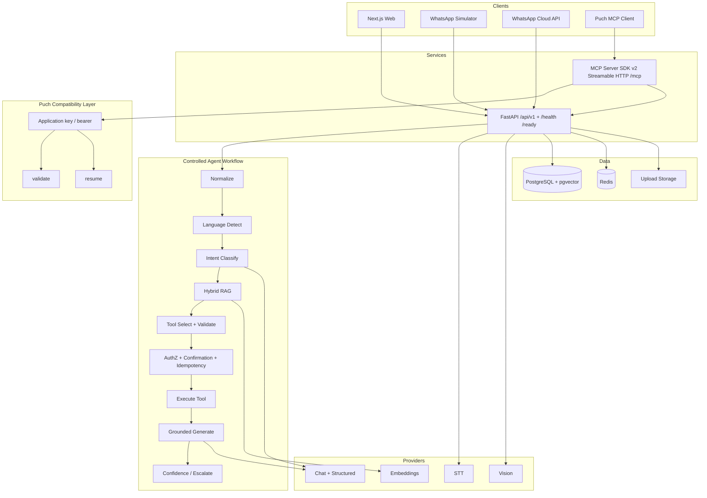
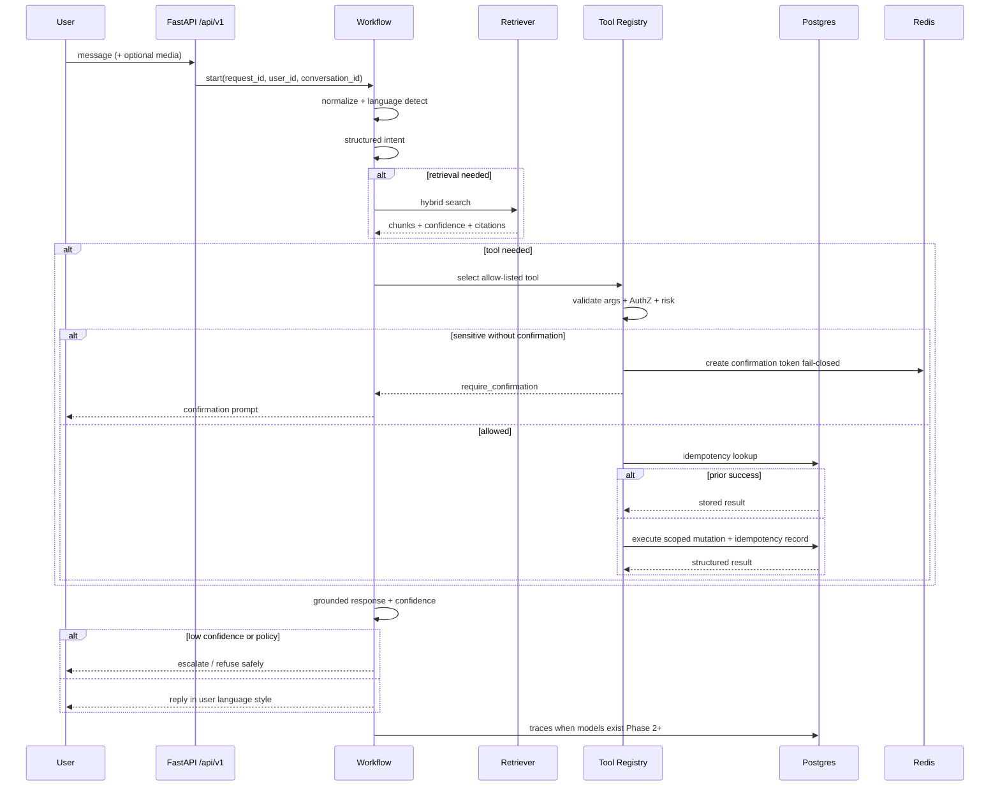
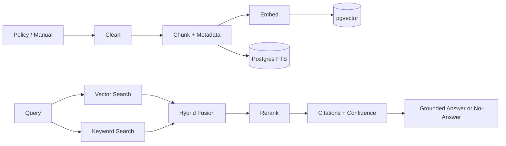
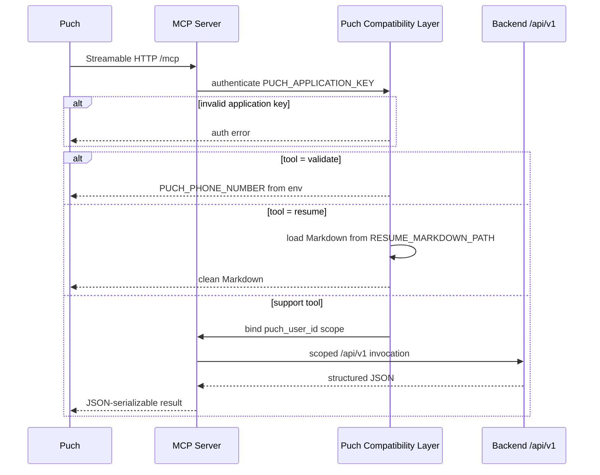

# VaaniDesk Architecture

**Phase:** 0 (planning — conditional approval corrections applied)
**Companion docs:** [`../PLAN.md`](../PLAN.md), [`../TASKS.md`](../TASKS.md), [`ADR.md`](./ADR.md)

---

## 1. Product context

VaaniDesk is an AI support desk for a fictional e-commerce company. It must handle multilingual, code-switched customer messages; retrieve policy evidence; call allow-listed business tools; optionally process voice and images; expose tools via a Puch-compatible MCP server; and record traces for evaluation and operations.

---

## 2. Design principles

1. **Controlled workflow** — explicit steps, not an unbounded autonomous agent loop.
2. **Provider abstraction** — mock by default; OpenAI/Anthropic optional.
3. **Allow-listed tools only** — models never gain arbitrary code or DB access.
4. **User-data isolation** — every customer query is scoped by authenticated user identity.
5. **Untrusted retrieval** — documents are data, never instructions.
6. **Observable by default** — request IDs, traces, latencies, token/cost estimates.
7. **Honest demos** — simulators and mocks are labeled; no fake live integrations.
8. **Fail closed on security dependencies** — see Redis policy below.
9. **Idempotent sensitive mutations** — durable idempotency records prevent double-apply.

---

## 3. High-level architecture

### HTTP surface

| Endpoint class | Prefix | Notes |
|----------------|--------|-------|
| Business APIs | `/api/v1/...` | Chat, orders, admin surfaces, etc. |
| Liveness | `/health` | Unversioned |
| Readiness | `/ready` | Unversioned |
| MCP | `/mcp` | Unversioned; MCP service; Streamable HTTP |

---

## 4. Agent workflow

### Sensitive confirmation + idempotency

1. Issue confirmation token (Redis; **fail closed** if Redis down).
2. On confirm, bind `idempotency_key` → durable Postgres idempotency record.
3. Replays return the first successful structured result; no second side effect.

---

## 5. RAG pipeline

### Mock embeddings (offline testing only)

When `EMBEDDING_PROVIDER=mock`, vectors are produced by **deterministic lexical hashing** over normalized word and/or character n-grams. This supports reproducible retrieval plumbing tests without API keys.

**These are not production semantic embeddings.** Meaningful semantic retrieval requires a real embedding provider.

Retrieved text is wrapped in delimiters and treated as untrusted data in the system prompt.

---

## 6. MCP request flow (SDK v2 + Streamable HTTP + Puch layer)

### Mandatory Puch application tools

| Tool | Behavior | Config |
|------|----------|--------|
| `validate` | Returns the configured phone number | `PUCH_PHONE_NUMBER` |
| `resume` | Returns clean Markdown from disk | `RESUME_MARKDOWN_PATH` |

Auth for Puch flows uses `PUCH_APPLICATION_KEY` via the compatibility layer. **Never hardcode** key, phone, or resume contents.

Cross-user support-tool access fails closed. Secrets never appear in MCP payloads.

Implementation stack: **current MCP Python SDK v2**, transport **Streamable HTTP**, endpoint `/mcp`.

---

## 7. Redis failure policy

| Concern | Behavior if Redis is down |
|---------|---------------------------|
| Optional caches | Degrade gracefully |
| Confirmation tokens | **Fail closed** |
| Webhook / replay protection | **Fail closed** |
| Sensitive-action authorization state | **Fail closed** |
| Security rate limits | **Fail closed** |

---

## 8. Backend module map

| Package | Responsibility |
|---------|----------------|
| `api/` | Versioned `/api/v1` routers |
| `core/` | Config, lifespan, `/health`, `/ready` |
| `workflows/` | Step orchestrator |
| `agents/` | Language, intent, response policy helpers |
| `tools/` | Allow-listed tool implementations + registry |
| `rag/` | Ingest, retrieve, fuse, cite |
| `providers/` | LLM, embed, STT, TTS, vision |
| `channels/` | Web, WhatsApp cloud, simulator |
| `security/` | AuthZ, confirmation, idempotency, rate limit, redaction |
| `observability/` | Traces, metrics queries |
| `models/` / `schemas/` | ORM + Pydantic |

### Phase 1 models only

`User`, `Conversation`, `Message`, `Product`, `Order`, `OrderItem`

Later: tickets, knowledge, traces, feedback, evaluation tables — see [`ADR.md`](./ADR.md) ADR-017.

---

## 9. Frontend routes (planned)

| Route | Purpose |
|-------|---------|
| `/` | Product landing / demo entry |
| `/chat` | Multimodal support chat |
| `/dashboard` | Ops metrics from real traces |
| `/knowledge` | Document ingest and retrieval test |
| `/conversations` | Conversation browser (redacted) |
| `/evaluations` | Eval runs and failure inspection |
| `/settings` | Provider/mode configuration display |

Node.js **24** LTS (`.nvmrc`). Engineering clarity over decorative motion.

---

## 10. Isolation and safety (summary)

- Tool names come from a server-side registry, never free model strings.
- Order/ticket reads filter by `user_id`.
- Confirmation tokens + idempotency records for sensitive mutations.
- Prompt injection in user text or documents must not expand tool permissions.
- Uploads: MIME allow-list, size/duration caps, safe error paths.
- Redis security dependencies fail closed.

Full threat model: [`SECURITY.md`](./SECURITY.md) (stub in Phase 0; complete in Phase 7).

---

## 11. Mock vs real providers

| Interface | Mock | Real |
|-----------|------|------|
| Chat / structured | Deterministic heuristics + fixtures | OpenAI / Anthropic |
| Embeddings | Deterministic lexical n-gram hashing (offline tests only; **not** semantic) | Provider embeddings |
| STT / TTS / Vision | Fixture / heuristic | Optional cloud APIs |

Configuration via environment variables (see `.env.example`).

---

## 11. Phase 1 status notes

Implemented: FastAPI app, Phase 1 models + Alembic, mock provider, `/api/v1` chat, Next.js `/` + `/chat`, Compose files, unit tests, Ruff, frontend lint/build, `uv.lock`, `package-lock.json`.

Blocked on this machine until Docker Desktop is installed with Administrator rights: live Postgres+pgvector, migrations/seed verification, integration tests, end-to-end Compose health.

`mypy` may be blocked by Windows Application Control (os error 4551) — treat as environment policy blocker, not a code defect.

## 12. Open decisions (resolve in later phases)

- Deploy target (Render vs Fly vs Railway) — Phase 7.
- MCP → backend: prefer HTTP to `/api/v1` for isolation (Phase 5).
